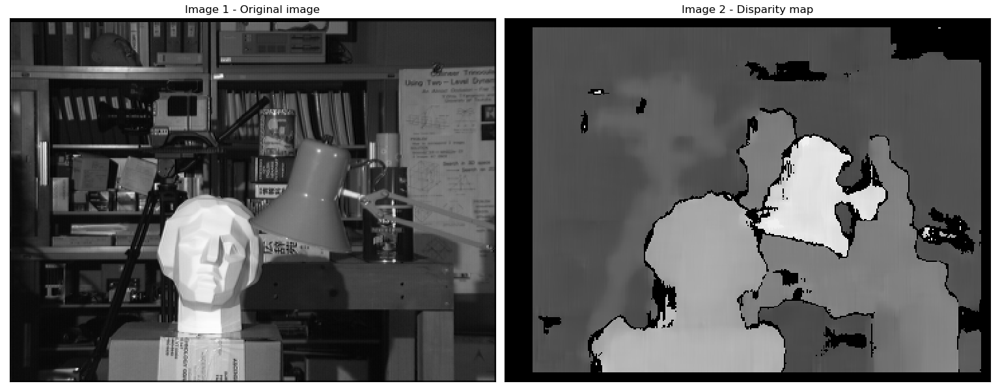

# Depth Map from Stereo Images 

_You can view [IPython Nootebook](README.ipynb) report._

----

## Contents

- [GOAL](#GOAL)
- [Basics](#Basics)
- [Code](#Code)
- [Exercises](#Exercises)

## GOAL

In this session:

- We will learn to create a depth map from stereo images.

## Basics

In the last session, we saw basic concepts like epipolar constraints and other related terms. We also saw that if we have two images of same scene, we can get depth information from that in an intuitive way. Below is an image and some simple mathematical formulas which prove that intuition.


The above diagram contains equivalent triangles. Writing their equivalent equations will yield us following result:

$$
disparity = x - x' = \frac{Bf}{Z},
$$

$ x $ and $ x′ $ are the distance between points in image plane corresponding to the scene point 3D and their camera center. $ B $ is the distance between two cameras (which we know) and $ f $ is the focal length of camera (already known). So in short, the above equation says that the depth of a point in a scene is inversely proportional to the difference in distance of corresponding image points and their camera centers. So with this information, we can derive the depth of all pixels in an image.

So it finds corresponding matches between two images. We have already seen how epiline constraint make this operation faster and accurate. Once it finds matches, it finds the disparity. Let's see how we can do it with OpenCV.

## Code

Below code snippet shows a simple procedure to create a disparity map.

```python
import cv2 as cv
from matplotlib import pyplot as plt

imgL = cv.imread("../../data/tsukuba_l.png", 0)
imgR = cv.imread("../../data/tsukuba_r.png", 0)

stereo = cv.StereoBM_create(numDisparities=16, blockSize=15)
disparity = stereo.compute(imgL, imgR)

# cv.imwrite("output-files/depth-map-res.png", disparity)
plt.subplot(121), plt.imshow(imgL), plt.title("Image 1 - Original image")
plt.xticks([]), plt.yticks([])
plt.subplot(122), plt.imshow(disparity), plt.title("Image 2 - Disparity map")
plt.xticks([]), plt.yticks([])
plt.subplots_adjust(left=0.01, right=0.99, wspace=0.02)
plt.show()
```

Below image contains the original image (left) and its disparity map (right). As you can see, the result is contaminated with high degree of noise. By adjusting the values of numDisparities and blockSize, you can get a better result.



### Note

> More details to be added

## Exercises

1. OpenCV samples contain an example of generating disparity map and its 3D reconstruction. Check stereo_match.py in OpenCV-Python samples.
