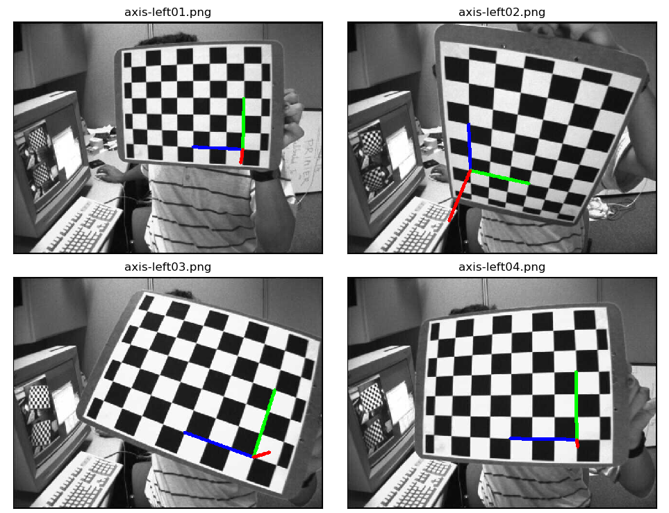
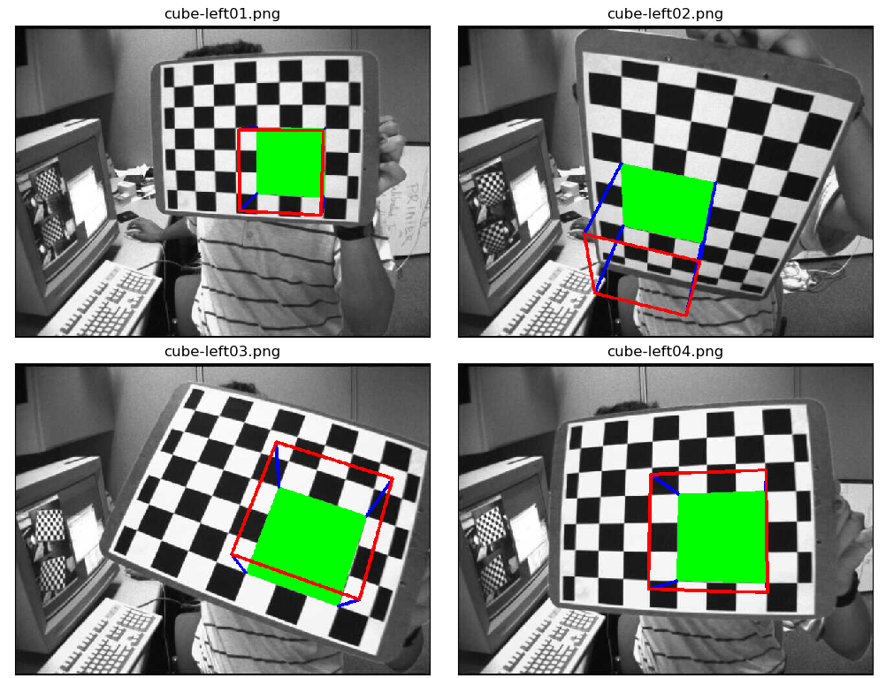

# Pose Estimation

_You can view [IPython Nootebook](README.ipynb) report._

----

## Contents

- [GOAL](#GOAL)
- [Basics](#Basics)
  - [Render the Axes](#Render-the-Axes)
  - [Render a Cube](#Render-a-Cube)

## GOAL

In this section:

- We will learn to exploit calib3d module to create some 3D effects in images.

## Basics

### Render the Axes

This is going to be a small section. During the last session on camera calibration, you have found the camera matrix, distortion coefficients etc. Given a pattern image, we can utilize the above information to calculate its pose, or how the object is situated in space, like how it is rotated, how it is displaced etc. For a planar object, we can assume Z=0, such that, the problem now becomes how camera is placed in space to see our pattern image. So, if we know how the object lies in the space, we can draw some 2D diagrams in it to simulate the 3D effect. Let's see how to do it.

Our problem is, we want to draw our 3D coordinate axis (X, Y, Z axes) on our chessboard's first corner. X axis in blue color, Y axis in green color and Z axis in red color. So in-effect, Z axis should feel like it is perpendicular to our chessboard plane.

First, let's load the camera matrix and distortion coefficients from the previous calibration result.

```python
import numpy as np
import cv2 as cv
import glob

# Load previously saved data
with np.load('B.npz') as X:
    mtx, dist, _, _ = [X[i] for i in ('mtx', 'dist', 'rvecs', 'tvecs')]
```

Now let's create a function, draw which takes the corners in the chessboard (obtained using [cv.findChessboardCorners()](https://docs.opencv.org/3.4.1/d9/d0c/group__calib3d.html#ga93efa9b0aa890de240ca32b11253dd4a)) and axis points to draw a 3D axis.

```python
def draw(img, corners, imgpts):
    corner = tuple(corners[0].ravel())
    img = cv.line(img, corner, tuple(imgpts[0].ravel()), (255,0,0), 5)
    img = cv.line(img, corner, tuple(imgpts[1].ravel()), (0,255,0), 5)
    img = cv.line(img, corner, tuple(imgpts[2].ravel()), (0,0,255), 5)
    return img
```

Then as in previous case, we create termination criteria, object points (3D points of corners in chessboard) and axis points. Axis points are points in 3D space for drawing the axis. We draw axis of length 3 (units will be in terms of chess square size since we calibrated based on that size). So our X axis is drawn from (0,0,0) to (3,0,0), so for Y axis. For Z axis, it is drawn from (0,0,0) to (0,0,-3). Negative denotes it is drawn towards the camera.

```python
criteria = (cv.TERM_CRITERIA_EPS + cv.TERM_CRITERIA_MAX_ITER, 30, 0.001)
objp = np.zeros((6*7,3), np.float32)
objp[:, :2] = np.mgrid[0:7, 0:6].T.reshape(-1, 2)
axis = np.float32([[3, 0, 0], [0, 3, 0], [0, 0, -3]]).reshape(-1, 3)
```

Now, as usual, we load each image. Search for 7x6 grid. If found, we refine it with subcorner pixels. Then to calculate the rotation and translation, we use the function, [cv.solvePnPRansac()](https://docs.opencv.org/3.4.1/d9/d0c/group__calib3d.html#ga50620f0e26e02caa2e9adc07b5fbf24e). Once we those transformation matrices, we use them to project our axis points to the image plane. In simple words, we find the points on image plane corresponding to each of (3,0,0), (0,3,0), (0,0,3) in 3D space. Once we get them, we draw lines from the first corner to each of these points using our draw() function. Done !!!

```python
for fname in glob.glob("../../data/left*.jpg"):
    print(fname)
    img = cv.imread(fname)
    gray = cv.cvtColor(img,cv.COLOR_BGR2GRAY)
    ret, corners = cv.findChessboardCorners(gray, (7, 6), None)
    if ret is True:
        corners2 = cv.cornerSubPix(gray, corners, (11, 11), (-1, -1), criteria)

        # Find the rotation and translation vectors.
        ret, rvecs, tvecs = cv.solvePnP(objp, corners2, mtx, dist)

        # Project 3D points to image plane
        imgpts, jac = cv.projectPoints(axis, rvecs, tvecs, mtx, dist)
        img = draw(img, corners2, imgpts)
        cv.imshow("Image - {}".format(str(fname[11:])), img)
        k = cv.waitKey(5000) & 0xFF
        if k == 27:  # Press "Esc" to exit
            break
        elif k == ord('n'):  # Press 'n' to open next image
            cv.destroyWindow("Image - {}".format(str(fname[11:])))
        elif k == ord('s'):  # Press 's' to save current image
            cv.destroyWindow("Image - {}".format(str(fname[11:])))
            cv.imwrite("output-files/" + "axis-" + str(fname[11:17]) +
                       ".png", img)
cv.destroyAllWindows()
```

See some results below. Notice that each axis is 3 squares long:



### Render a Cube

If you want to draw a cube, modify the draw() function and axis points as follows.

Modified draw() function:

```python
def draw(img, corners, imgpts):
    imgpts = np.int32(imgpts).reshape(-1, 2)

    # Draw ground floor in green
    img = cv.drawContours(img, [imgpts[:4]], -1, (0, 255, 0), -3)

    # Draw pillars in blue color
    for i, j in zip(range(4), range(4, 8)):
        img = cv.line(img, tuple(imgpts[i]), tuple(imgpts[j]), (255), 3)

    # Draw top layer in red color
    img = cv.drawContours(img, [imgpts[4:]], -1, (0, 0, 255), 3)
    return img
```

Modified axis points. They are the 8 corners of a cube in 3D space:

```python
axis = np.float32([[0, 0, 0], [0, 3, 0], [3, 3, 0], [3, 0, 0],
                   [0, 0, -3], [0, 3, -3], [3, 3, -3], [3, 0, -3]])
```

And look at the result below:



If you are interested in graphics, augmented reality etc, you can use OpenGL to render more complicated figures.
