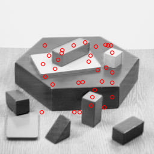

# BRIEF (Binary Robust Independent Elementary Features)

_You can view [IPython Notebook](README.ipynb) report._

----

## Contents

- [GOAL](#GOAL)
- [Theory](#Theory)
- [BRIEF in OpenCV](#BRIEF-in-OpenCV)
- [Additional Resources](#Additional-Resources)

## GOAL

In this chapter:

- We will see the basics of BRIEF algorithm

## Theory

We know SIFT uses 128-dim vector for descriptors. Since it is using floating point numbers, it takes basically 512 bytes. Similarly SURF also takes minimum of 256 bytes (for 64-dim). Creating such a vector for thousands of features takes a lot of memory which are not feasible for resouce-constraint applications especially for embedded systems. Larger the memory, longer the time it takes for matching.

But all these dimensions may not be needed for actual matching. We can compress it using several methods like PCA, LDA etc. Even other methods like hashing using LSH (Locality Sensitive Hashing) is used to convert these SIFT descriptors in floating point numbers to binary strings. These binary strings are used to match features using Hamming distance. This provides better speed-up because finding hamming distance is just applying XOR and bit count, which are very fast in modern CPUs with SSE instructions. But here, we need to find the descriptors first, then only we can apply hashing, which doesn't solve our initial problem on memory.

BRIEF comes into picture at this moment. It provides a shortcut to find the binary strings directly without finding descriptors. It takes smoothened image patch and selects a set of $ n_d $ $ (x,y) $ location pairs in an unique way (explained in paper). Then some pixel intensity comparisons are done on these location pairs. For eg, let first location pairs be $ p $ and $ q $. If $ I(p)<I(q) $, then its result is 1, else it is 0. This is applied for all the $ n_d $ location pairs to get a $ n_d $-dimensional bitstring.

This $ n_d $ can be 128, 256 or 512. OpenCV supports all of these, but by default, it would be 256 (OpenCV represents it in bytes. So the values will be 16, 32 and 64). So once you get this, you can use Hamming Distance to match these descriptors.

One important point is that BRIEF is a feature descriptor, it doesn't provide any method to find the features. So you will have to use any other feature detectors like SIFT, SURF etc. The paper recommends to use CenSurE which is a fast detector and BRIEF works even slightly better for CenSurE points than for SURF points.

In short, BRIEF is a faster method feature descriptor calculation and matching. It also provides high recognition rate unless there is large in-plane rotation.

## BRIEF in OpenCV

Below code shows the computation of BRIEF descriptors with the help of CenSurE detector. (CenSurE detector is called STAR detector in OpenCV)

NOTE: you need [opencv contrib](https://github.com/opencv/opencv_contrib) to use this. 

```python
import cv2 as cv

img = cv.imread("../../data/blox.jpg", 0)
# Initiate FAST detector
star = cv.xfeatures2d.StarDetector_create()
# Initiate BRIEF extractor
brief = cv.xfeatures2d.BriefDescriptorExtractor_create()
# find the keypoints with STAR
kp = star.detect(img, None)
# compute the descriptors with BRIEF
kp, des = brief.compute(img, kp)

img2 = cv.drawKeypoints(img, kp, None, color=(0, 0, 255), flags=0)
cv.imwrite("output-files/brief-result.png", img2)
cv.imshow("Result", img2)

print(brief.descriptorSize())
print(des.shape)
```

The result is below:



## Additional Resources

1. Michael Calonder, Vincent Lepetit, Christoph Strecha, and Pascal Fua, "BRIEF: Binary Robust Independent Elementary Features", 11th European Conference on Computer Vision (ECCV), Heraklion, Crete. LNCS Springer, September 2010.
2. [LSH (Locality Sensitive Hashing)](https://en.wikipedia.org/wiki/Locality-sensitive_hashing) at wikipedia.

