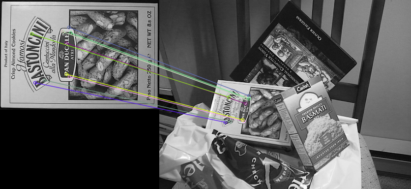
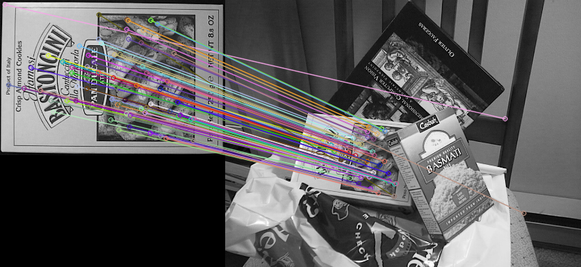
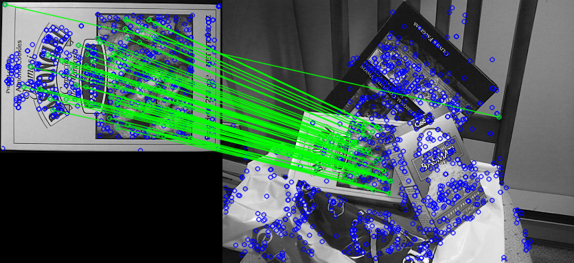

# Feature Matching

_You can view [IPython Nootebook](README.ipynb) report._

----

## Contents

- [GOAL](#GOAL)
- [Basics of Brute-Force Matcher](#Basics-of-Brute-Force-Matcher)
  - [Brute-Force Matching with ORB Descriptors](#Brute-Force-Matching-with-ORB-Descriptors)
  - [What is this Matcher Object?](#What-is-this-Matcher-Object?)
  - [Brute-Force Matching with SIFT Descriptors and Ratio Test](#Brute-Force-Matching-with-SIFT-Descriptors-and-Ratio-Test)
- [FLANN based Matcher](#FLANN-based-Matcher)

## GOAL

In this chapter:

- We will see how to match features in one image with others.
- We will use the Brute-Force matcher and FLANN Matcher in OpenCV.

## Basics of Brute-Force Matcher

Brute-Force matcher is simple. It takes the descriptor of one feature in first set and is matched with all other features in second set using some distance calculation. And the closest one is returned.

For BF matcher, first we have to create the BFMatcher object using [cv.BFMatcher()](https://docs.opencv.org/3.4.1/d3/da1/classcv_1_1BFMatcher.html). It takes two optional params. First one is **normType**. It specifies the distance measurement to be used. By default, it is [cv.NORM_L2](https://docs.opencv.org/3.4.1/d2/de8/group__core__array.html#ggad12cefbcb5291cf958a85b4b67b6149fa7bacbe84d400336a8f26297d8e80e3a2). It is good for SIFT, SURF etc ([cv.NORM_L1](https://docs.opencv.org/3.4.1/d2/de8/group__core__array.html#ggad12cefbcb5291cf958a85b4b67b6149fab55c78ff204a979026c026ea19de65c9) is also there). For binary string based descriptors like ORB, BRIEF, BRISK etc, [cv.NORM_HAMMING](https://docs.opencv.org/3.4.1/d2/de8/group__core__array.html#ggad12cefbcb5291cf958a85b4b67b6149fa4b063afd04aebb8dd07085a1207da727) should be used, which used Hamming distance as measurement. If ORB is using WTA_K == 3 or 4, [cv.NORM_HAMMING2](https://docs.opencv.org/3.4.1/d2/de8/group__core__array.html#ggad12cefbcb5291cf958a85b4b67b6149fa7fab9cda83e79380cd273c49de8e3231) should be used.

Second param is boolean variable, **crossCheck** which is false by default. If it is true, Matcher returns only those matches with value (i,j) such that i-th descriptor in set A has j-th descriptor in set B as the best match and vice-versa. That is, the two features in both sets should match each other. It provides consistent result, and is a good alternative to ratio test proposed by D.Lowe in SIFT paper.

Once it is created, two important methods are _BFMatcher.match()_ and _BFMatcher.knnMatch()_. First one returns the best match. Second method returns k best matches where k is specified by the user. It may be useful when we need to do additional work on that.

Like we used [cv.drawKeypoints()](https://docs.opencv.org/3.4.1/d4/d5d/group__features2d__draw.html#gab958f8900dd10f14316521c149a60433) to draw keypoints, [cv.drawMatches()](https://docs.opencv.org/3.4.1/d4/d5d/group__features2d__draw.html#ga7421b3941617d7267e3f2311582f49e1) helps us to draw the matches. It stacks two images horizontally and draw lines from first image to second image showing best matches. There is also **cv.drawMatchesKnn** which draws all the k best matches. If k=2, it will draw two match-lines for each keypoint. So we have to pass a mask if we want to selectively draw it.

Let's see one example for each of SURF and ORB (Both use different distance measurements).

### Brute-Force Matching with ORB Descriptors

Here, we will see a simple example on how to match features between two images. In this case, I have a _queryImage_ and _a trainImage_. We will try to find the _queryImage_ in _a trainImage_ using feature matching.

We are using ORB descriptors to match features. So let's start with loading images, finding descriptors etc.

```python
import numpy as np
import cv2 as cv

img1 = cv.imread("../../data/box.png", 0)  # queryImage
img2 = cv.imread("../../data/box_in_scene.png", 0)  # trainImage

# Initiate ORB detector
orb = cv.ORB_create()

# find the keypoints and descriptors with ORB
kp1, des1 = orb.detectAndCompute(img1, None)
kp2, des2 = orb.detectAndCompute(img2, None)
```

Next we create a BFMatcher object with distance measurement [cv.NORM_HAMMING](https://docs.opencv.org/3.4.1/d2/de8/group__core__array.html#ggad12cefbcb5291cf958a85b4b67b6149fa4b063afd04aebb8dd07085a1207da727) (since we are using ORB) and crossCheck is switched on for better results. Then we use **Matcher.match()** method to get the best matches in two images. We sort them in ascending order of their distances so that best matches (with low distance) come to front. Then we draw only first 10 matches (Just for sake of visibility. You can increase it as you like) 

```python
# create BFMatcher object
bf = cv.BFMatcher(cv.NORM_HAMMING, crossCheck=True)

# Match descriptors.
matches = bf.match(des1, des2)

# Sort them in the order of their distance.
matches = sorted(matches, key=lambda x: x.distance)

# Draw first 10 matches.
img3 = cv.drawMatches(img1, kp1, img2, kp2, matches[:10], None, flags=2)

cv.imwrite("output-files/bf-matcher-res.png", img3)
cv.imshow("Result", img3)
k = cv.waitKey(0)
while True:
    if k == 27:
        cv.destroyAllWindows()
        break
```

Below is the result I got:



### What is this Matcher Object?

The result of _matches = bf.match(des1,des2)_ line is a list of **DMatch** objects. This DMatch object has following attributes:

- **DMatch.distance** - Distance between descriptors. The lower, the better it is.
- **DMatch.trainIdx** - Index of the descriptor in train descriptors
- **DMatch.queryIdx** - Index of the descriptor in query descriptors
- **DMatch.imgIdx** - Index of the train image.

### Brute-Force Matching with SIFT Descriptors and Ratio Test

This time, we will use **BFMatcher.knnMatch()** to get k best matches. In this example, we will take k=2 so that we can apply ratio test explained by D.Lowe in his paper.

```python
import numpy as np
import cv2 as cv

img1 = cv.imread("../../data/box.png", 0)  # queryImage
img2 = cv.imread("../../data/box_in_scene.png", 0)  # trainImage

# Initiate SIFT detector
sift = cv.xfeatures2d.SIFT_create()

# find the keypoints and descriptors with SIFT
kp1, des1 = sift.detectAndCompute(img1, None)
kp2, des2 = sift.detectAndCompute(img2, None)

# BFMatcher with default params
bf = cv.BFMatcher()
matches = bf.knnMatch(des1, des2, k=2)

# Apply ratio test
good = []
for m, n in matches:
    if m.distance < 0.75*n.distance:
        good.append([m])

# cv.drawMatchesKnn expects list of lists as matches.
img3 = cv.drawMatchesKnn(img1, kp1, img2, kp2, good, None, flags=2)

cv.imwrite("output-files/bf-matcher-sift-res.png", img3)
cv.imshow("Result", img3)
k = cv.waitKey(0)
while True:
    if k == 27:
        cv.destroyAllWindows()
        break
```

See the result below:



## FLANN based Matcher

FLANN stands for Fast Library for Approximate Nearest Neighbors. It contains a collection of algorithms optimized for fast nearest neighbor search in large datasets and for high dimensional features. It works faster than BFMatcher for large datasets. We will see the second example with FLANN based matcher.

For FLANN based matcher, we need to pass two dictionaries which specifies the algorithm to be used, its related parameters etc. First one is **IndexParams**. For various algorithms, the information to be passed is explained in FLANN docs. As a summary, for algorithms like SIFT, SURF etc. you can pass following: 

```python
FLANN_INDEX_KDTREE = 1
index_params = dict(algorithm = FLANN_INDEX_KDTREE, trees = 5)
```

While using ORB, you can pass the following. The commented values are recommended as per the docs, but it didn't provide required results in some cases. Other values worked fine:

```python
FLANN_INDEX_LSH = 6
index_params= dict(algorithm = FLANN_INDEX_LSH,
                   table_number = 6, # 12
                   key_size = 12,     # 20
                   multi_probe_level = 1) #2
```

Second dictionary is the **SearchParams**. It specifies the number of times the trees in the index should be recursively traversed. Higher values gives better precision, but also takes more time. If you want to change the value, pass _search_params = dict(checks=100)_.

With this information, we are good to go.

```python
import numpy as np
import cv2 as cv

img1 = cv.imread("../../data/box.png", 0)  # queryImage
img2 = cv.imread("../../data/box_in_scene.png", 0)  # trainImage

# Initiate SIFT detector
sift = cv.xfeatures2d.SIFT_create()

# find the keypoints and descriptors with SIFT
kp1, des1 = sift.detectAndCompute(img1, None)
kp2, des2 = sift.detectAndCompute(img2, None)

# FLANN parameters
FLANN_INDEX_KDTREE = 1
index_params = dict(algorithm=FLANN_INDEX_KDTREE, trees=5)
search_params = dict(checks=50)  # or pass empty dictionary
flann = cv.FlannBasedMatcher(index_params, search_params)
matches = flann.knnMatch(des1, des2, k=2)

# Need to draw only good matches, so create a mask
matchesMask = [[0, 0] for i in range(len(matches))]

# ratio test as per Lowe's paper
for i, (m, n) in enumerate(matches):
    if m.distance < 0.7*n.distance:
        matchesMask[i] = [1, 0]
draw_params = dict(matchColor=(0, 255, 0),
                   singlePointColor=(255, 0, 0),
                   matchesMask=matchesMask,
                   flags=0)

res = np.zeros(img1.shape, dtype=np.uint8)
img3 = cv.drawMatchesKnn(img1, kp1, img2, kp2, matches, None, **draw_params)

cv.imwrite("output-files/flann-matcher-res.png", img3)
cv.imshow("Result", img3)
k = cv.waitKey(0)
while True:
    if k == 27:
        cv.destroyAllWindows()
        break
```

See the result below:


