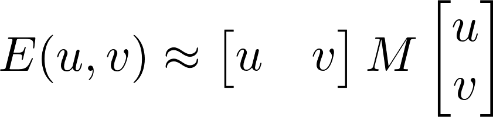

# Harris Corner Detection 

## Contents

- [GOAL](#GOAL)
- [Theory](#Theory)
- [Harris Corner Detector in OpenCV ](#Harris-Corner-Detector-in-OpenCV )
- [Corner with SubPixel Accuracy ](#Corner-with-SubPixel Accuracy )

## GOAL

In this chapter,

- We will understand the concepts behind Harris Corner Detection.
- We will see the functions: cv.cornerHarris(), cv.cornerSubPix().

## Theory

In last chapter, we saw that corners are regions in the image with large variation in intensity in all the directions. One early attempt to find these corners was done by Chris Harris & Mike Stephens in their paper A Combined Corner and Edge Detector in 1988, so now it is called Harris Corner Detector. He took this simple idea to a mathematical form. It basically finds the difference in intensity for a displacement of (u,v) in all directions. This is expressed as below:

![$$ E(u,v) = \sum_{x,y} \underbrace{w(x,y)}_\text{window function} \, [\underbrace{I(x+u,y+v)}_\text{shifted intensity}-\underbrace{I(x,y)}_\text{intensity}]^2 $$](data/equation-1.png)

Window function is either a rectangular window or gaussian window which gives weights to pixels underneath.

We have to maximize this function E(u,v) for corner detection. That means, we have to maximize the second term. Applying Taylor Expansion to above equation and using some mathematical steps (please refer any standard text books you like for full derivation), we get the final equation as:

