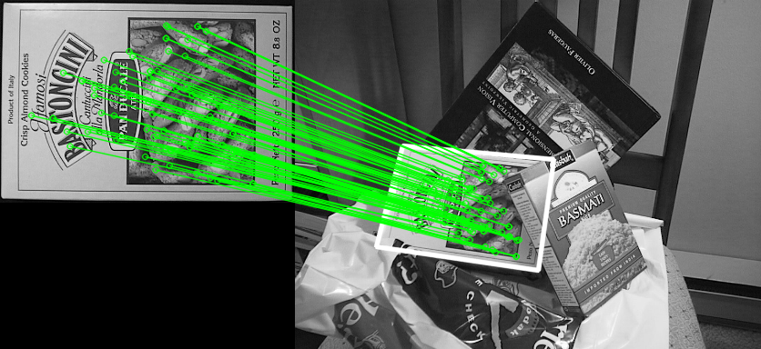

# Feature Matching + Homography to find Objects

_You can view [IPython Nootebook](README.ipynb) report._

----

## Contents

- [GOAL](#GOAL)
- [Basics](#Basics)
- [Code](#Code)

## GOAL

In this chapter:

- We will mix up the feature matching and _findHomography_ from _calib3d_ module to find known objects in a complex image.

## Basics

So what we did in last session? We used a _queryImage_, found some feature points in it, we took another _trainImage_, found the features in that image too and we found the best matches among them. In short, we found locations of some parts of an object in another cluttered image. This information is sufficient to find the object exactly on the _trainImage_.

For that, we can use a function from **calib3d** module, ie [cv.findHomography()](https://docs.opencv.org/3.4.1/d9/d0c/group__calib3d.html#ga4abc2ece9fab9398f2e560d53c8c9780). If we pass the set of points from both the images, it will find the perpective transformation of that object. Then we can use [cv.perspectiveTransform()](https://docs.opencv.org/3.4.1/d2/de8/group__core__array.html#gad327659ac03e5fd6894b90025e6900a7) to find the object. It needs atleast four correct points to find the transformation.

We have seen that there can be some possible errors while matching which may affect the result. To solve this problem, algorithm uses RANSAC or LEAST_MEDIAN (which can be decided by the flags). So good matches which provide correct estimation are called inliers and remaining are called outliers. [cv.findHomography()](https://docs.opencv.org/3.4.1/d9/d0c/group__calib3d.html#ga4abc2ece9fab9398f2e560d53c8c9780) returns a mask which specifies the inlier and outlier points.

So let's do it !!!

## Code

First, as usual, let's find SIFT features in images and apply the ratio test to find the best matches.

```python
import numpy as np
import cv2 as cv

MIN_MATCH_COUNT = 10

img1 = cv.imread("../../data/blox.jpg", 0)  # queryImage
img2 = cv.imread("../../data/box_in_scene.png", 0)  # trainImage

# Initiate SIFT detector
sift = cv.xfeatures2d.SIFT_create()

# find the keypoints and descriptors with SIFT
kp1, des1 = sift.detectAndCompute(img1, None)
kp2, des2 = sift.detectAndCompute(img2, None)

# FLANN parameters
FLANN_INDEX_KDTREE = 1
index_params = dict(algorithm=FLANN_INDEX_KDTREE, trees=5)
search_params = dict(checks=50)
flann = cv.FlannBasedMatcher(index_params, search_params)
matches = flann.knnMatch(des1, des2, k=2)

# store all the good matches as per Lowe's ratio test.
good = []
for m, n in matches:
    if m.distance < 0.7*n.distance:
        good.append(m)
```

Now we set a condition that atleast 10 matches (defined by MIN_MATCH_COUNT) are to be there to find the object. Otherwise simply show a message saying not enough matches are present.

If enough matches are found, we extract the locations of matched keypoints in both the images. They are passed to find the perpective transformation. Once we get this 3x3 transformation matrix, we use it to transform the corners of queryImage to corresponding points in trainImage. Then we draw it. 

```python
if len(good) > MIN_MATCH_COUNT:
    src_pts = np.float32([kp1[m.queryIdx].pt for m in good]).reshape(-1, 1, 2)
    dst_pts = np.float32([kp2[m.trainIdx].pt for m in good]).reshape(-1, 1, 2)
    M, mask = cv.findHomography(src_pts, dst_pts, cv.RANSAC, 5.0)
    matchesMask = mask.ravel().tolist()
    h, w = img1.shape
    pts = np.float32([[0, 0], [0, h-1], [w-1, h-1], \
                      [w-1, 0]]).reshape(-1, 1, 2)
    dst = cv.perspectiveTransform(pts, M)
    img2 = cv.polylines(img2, [np.int32(dst)], True, 255, 3, cv.LINE_AA)
else:
    print("Not enough matches are found - {}/{}".format(len(good), \
                                                        MIN_MATCH_COUNT))
    matchesMask = None
```

Finally we draw our inliers (if successfully found the object) or matching keypoints (if failed).


See the result below. Object is marked in white color in cluttered image:

```python
draw_params = dict(matchColor=(0, 255, 0), # draw matches in green color
                   singlePointColor=None,
                   matchesMask=matchesMask, # draw only inliers
                   flags=2)
img3 = cv.drawMatches(img1, kp1, img2, kp2, good, None, **draw_params)
cv.imwrite("output-files/homography-res.png", img3)
cv.imshow("result", img3)
k = cv.waitKey(0)
while True:
    if k == 27:
        cv.destroyAllWindows()
        break
```



