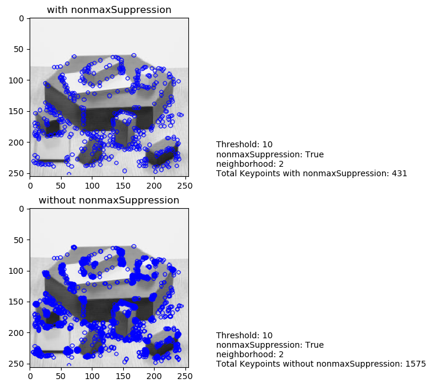

# FAST Algorithm for Corner Detection 

_You can view [IPython Notebook](README.ipynb) report._

----

## Contents

- [GOAL](#GOAL)
- [Theory](#Theory)
  - [Feature Detection using FAST](#Feature-Detection-using-FAST)
  - [Machine Learning a Corner Detector](#Machine-Learning-a-Corner-Detector)
  - [Non-maximal Suppression](#Non-maximal-Suppression)
  - [Summary](#Summary)
- [FAST Feature Detector in OpenCV ](#FAST-Feature-Detector-in-OpenCV)
- [Additional Resources](#Additional-Resources)

## GOAL

In this chapter:

- We will understand the basics of FAST algorithm.
- We will find corners using OpenCV functionalities for FAST algorithm.

## Theory

We saw several feature detectors and many of them are really good. But when looking from a real-time application point of view, they are not fast enough. One best example would be SLAM (Simultaneous Localization and Mapping) mobile robot which have limited computational resources.

As a solution to this, **FAST (Features from Accelerated Segment Test)** algorithm was proposed by **Edward Rosten** and **Tom Drummond** in their paper **["Machine learning for high-speed corner detection"](https://www.edwardrosten.com/work/rosten_2006_machine.pdf)** in 2006 (Later revised it in 2010). A basic summary of the algorithm is presented below. Refer original paper for more details (All the images are taken from original paper).

### Feature Detection using FAST

1. Select a pixel $ p $ in the image which is to be identified as an interest point or not. Let its intensity be $ I_p $.
2. Select appropriate threshold value $ t $.
3. Consider a circle of 16 pixels around the pixel under test. (See the image below)
 


4. Now the pixel $ p $ is a corner if there exists a set of $ n $ contiguous pixels in the circle (of 16 pixels) which are all brighter than $ I_p+t $, or all darker than $ I_p−t $. (Shown as white dash lines in the above image). $ n $ was chosen to be 12.
5. A **high-speed test** was proposed to exclude a large number of non-corners. This test examines only the four pixels at 1, 9, 5 and 13 (First 1 and 9 are tested if they are too brighter or darker. If so, then checks 5 and 13). If $ p $ is a corner, then at least three of these must all be brighter than $ I_p+t $ or darker than $ I_p−t $. If neither of these is the case, then $ p $ cannot be a corner. The full segment test criterion can then be applied to the passed candidates by examining all pixels in the circle. This detector in itself exhibits high performance, but there are several weaknesses:
 - It does not reject as many candidates for $ n < 12 $.
 - The choice of pixels is not optimal because its efficiency depends on ordering of the questions and distribution of corner appearances.
 - Results of high-speed tests are thrown away.
 - Multiple features are detected adjacent to one another.

First 3 points are addressed with a machine learning approach. Last one is addressed using non-maximal suppression.

### Machine Learning a Corner Detector

1. Select a set of images for training (preferably from the target application domain).
2. Run FAST algorithm in every images to find feature points.
3. For every feature point, store the 16 pixels around it as a vector. Do it for all the images to get feature vector $ P $.
4. Each pixel (say $ x $) in these 16 pixels can have one of the following three states:

$$ S_{p \rightarrow x} = \left\{\begin{matrix}
d, &         &       & I_{p\rightarrow x} & \leq & I_p - t & (darker) \\ 
s, & I_p - t & <     & I_{p\rightarrow x} & <    & I_p + t & (similar)\\ 
b, & I_p + t & \leq  & I_{p\rightarrow x} &      &         & (brighter)
\end{matrix}\right. $$

5. Depending on these states, the feature vector $ P $ is subdivided into 3 subsets, $ P_d $, $ P_s $, $ P_b $.
6. Define a new boolean variable, $ K_p $, which is true if $ p $ is a corner and false otherwise.
7. Use the ID3 algorithm (decision tree classifier) to query each subset using the variable $ K_p $ for the knowledge about the true class. It selects the $ x $ which yields the most information about whether the candidate pixel is a corner, measured by the entropy of $ K_p $.
8. This is recursively applied to all the subsets until its entropy is zero.
9. The decision tree so created is used for fast detection in other image.

### Non-maximal Suppression

Detecting multiple interest points in adjacent locations is another problem. It is solved by using Non-maximum Suppression.

1. Compute a score function, $ V $ for all the detected feature points. $ V $ is the sum of absolute difference between $ p $ and 16 surrounding pixels values.
2. Consider two adjacent keypoints and compute their $ V $ values.
3. Discard the one with lower $ V $ value.

### Summary

It is several times faster than other existing corner detectors. But it is not robust to high levels of noise. It is dependent on a threshold.

## FAST Feature Detector in OpenCV

It is called as any other feature detector in OpenCV. If you want, you can specify the threshold, whether non-maximum suppression to be applied or not, the neighborhood to be used etc.

For the neighborhood, three flags are defined, **cv.FAST_FEATURE_DETECTOR_TYPE_5_8**, **cv.FAST_FEATURE_DETECTOR_TYPE_7_12** and **cv.FAST_FEATURE_DETECTOR_TYPE_9_16**. Below is a simple code on how to detect and draw the FAST feature points.

```python
import numpy as np
import cv2 as cv
from matplotlib import pyplot as plt

img = cv.imread("../../data/blox.jpg", 0)

# Initiate FAST object with default values
fast = cv.FastFeatureDetector_create()

# find and draw the keypoints
kp = fast.detect(img, None)
img2 = cv.drawKeypoints(img, kp, None, color=(255, 0, 0))

# Print all default params
print("Threshold: {}".format(fast.getThreshold()), '\n'
      "nonmaxSuppression: {}".format(fast.getNonmaxSuppression()), '\n'
      "neighborhood: {}".format(fast.getType()), '\n'
      "Total Keypoints with nonmaxSuppression: {}".format(len(kp)))

cv.imwrite("output-files/fast_true.png", img2)
cv.imshow("With Suppression", img2)

# Disable nonmaxSuppression
fast.setNonmaxSuppression(False)
kp = fast.detect(img, None)
print("Total Keypoints without nonmaxSuppression: {}".format(len(kp)))

img3 = cv.drawKeypoints(img, kp, None, color=(255, 0, 0))
cv.imwrite("output-files/fast_false.png", img3)
cv.imshow("Without Suppression", img3)
k = cv.waitKey(0)
while True:
    if k == 27:
        cv.destroyAllWindows()
        break
```

See the results. First image shows FAST with nonmaxSuppression and second one without nonmaxSuppression:



## Additional Resources 

1. Edward Rosten and Tom Drummond, “Machine learning for high speed corner detection” in 9th European Conference on Computer Vision, vol. 1, 2006, pp. 430–443.
2. Edward Rosten, Reid Porter, and Tom Drummond, "Faster and better: a machine learning approach to corner detection" in IEEE Trans. Pattern Analysis and Machine Intelligence, 2010, vol 32, pp. 105-119.

