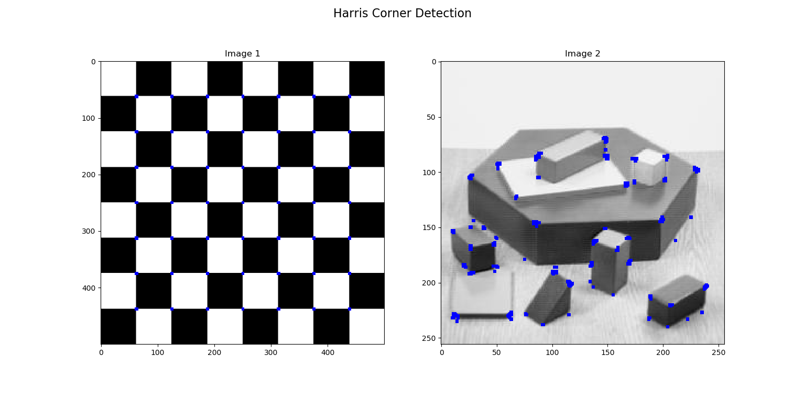
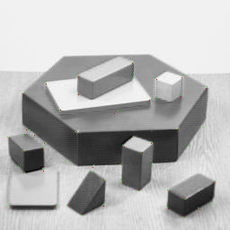

# Harris Corner Detection 

_You can view [IPyton Notebook](README.ipynb) report._

-----------

## Contents

- [GOAL](#GOAL)
- [Theory](#Theory)
- [Harris Corner Detector in OpenCV ](#Harris-Corner-Detector-in-OpenCV)
- [Corner with SubPixel Accuracy ](#Corner-with-SubPixel-Accuracy)

## GOAL

In this chapter:

- We will understand the concepts behind Harris Corner Detection.
- We will see the functions: [cv.cornerHarris()](https://docs.opencv.org/3.4.1/dd/d1a/group__imgproc__feature.html#gac1fc3598018010880e370e2f709b4345), [cv.cornerSubPix()](https://docs.opencv.org/3.4.1/dd/d1a/group__imgproc__feature.html#ga354e0d7c86d0d9da75de9b9701a9a87e).

## Theory

In last chapter, we saw that corners are regions in the image with large variation in intensity in all the directions. One early attempt to find these corners was done by Chris Harris & Mike Stephens in their paper A Combined Corner and Edge Detector in 1988, so now it is called Harris Corner Detector. He took this simple idea to a mathematical form. It basically finds the difference in intensity for a displacement of $ (u,v) $ in all directions. This is expressed as below:

$$ E(u,v) = \sum_{x,y} \underbrace{w(x,y)}_\text{window function} \, [\underbrace{I(x+u,y+v)}_\text{shifted intensity}-\underbrace{I(x,y)}_\text{intensity}]^2 $$

Window function is either a rectangular window or gaussian window which gives weights to pixels underneath.

We have to maximize this function $ E(u,v) $ for corner detection. That means, we have to maximize the second term. Applying Taylor Expansion to above equation and using some mathematical steps (please refer any standard text books you like for full derivation), we get the final equation as:

$$ E(u,v) \approx \begin{bmatrix} u & v \end{bmatrix} M \begin{bmatrix} u \\ v \end{bmatrix} $$

where

$$ M = \sum_{x,y} w(x,y) \begin{bmatrix}I_x I_x & I_x I_y \\ I_x I_y & I_y I_y \end{bmatrix} $$

Here, $ Ix $ and $ Iy $ are image derivatives in $ x $ and $ y $ directions respectively. (Can be easily found out using [cv.Sobel()](https://docs.opencv.org/3.4.1/d4/d86/group__imgproc__filter.html#gacea54f142e81b6758cb6f375ce782c8d)).

Then comes the main part. After this, they created a score, basically an equation, which will determine if a window can contain a corner or not.

$$ R = det(M) - k(trace(M))^2 $$

where

 - $ det(M) = \lambda_1 \lambda_2 $;
 - $ trace(M) = \lambda_1 + \lambda_2 $;
 - $ \lambda_1 $ and $ \lambda_1 $ are the eigen values of $ M $.
 
So the values of these eigen values decide whether a region is corner, edge or flat.

 - When $ |R| $ is small, which happens when $ \lambda_1 $ and $ \lambda_2 $ are small, the region is flat.
 - When $ R<0 $, which happens when $ \lambda_1 >> \lambda_2 $ or vice versa, the region is edge.
 - When $ R $ is large, which happens when $ \lambda_1 $ and $ \lambda_2 $ are large and $ \lambda_1 \sim \lambda_2 $, the region is a corner.

It can be represented in a nice picture as follows:


So the result of Harris Corner Detection is a grayscale image with these scores. Thresholding for a suitable give you the corners in the image. We will do it with a simple image.

## Harris Corner Detector in OpenCV 

OpenCV has the function [cv.cornerHarris()](https://docs.opencv.org/3.4.1/dd/d1a/group__imgproc__feature.html#gac1fc3598018010880e370e2f709b4345) for this purpose. Its arguments are :

 - **img** - Input image, it should be grayscale and float32 type.
 - **blockSize** - It is the size of neighbourhood considered for corner detection.
 - **ksize** - Aperture parameter of Sobel derivative used.
 - **k** - Harris detector free parameter in the equation.

See the example below:

```python
import numpy as np
import cv2 as cv

filename = 'input-files/chessboard.png'
img = cv.imread(filename)
img = cv.resize(img, dsize=(500, 500), interpolation=cv.INTER_LINEAR)
gray = cv.cvtColor(img, cv.COLOR_BGR2GRAY)

gray = np.float32(gray)
dst = cv.cornerHarris(gray, 2, 3, 0.04)

#result is dilated for marking the corners, not important
dst = cv.dilate(dst, None)

# Threshold for an optimal value, it may vary depending on the image.
img[dst > 0.01*dst.max()] = [255, 0, 0]

cv.namedWindow('dst', flags=cv.WINDOW_NORMAL)
cv.imshow('dst', img)
cv.imwrite('output-files/corners-chessboard.png', img)
if cv.waitKey(0) & 0xff == 27:
    cv.destroyAllWindows()
```

Below are the two results:



## Corner with SubPixel Accuracy

Sometimes, you may need to find the corners with maximum accuracy. OpenCV comes with a function [cv.cornerSubPix()](https://docs.opencv.org/3.4.1/dd/d1a/group__imgproc__feature.html#ga354e0d7c86d0d9da75de9b9701a9a87e) which further refines the corners detected with sub-pixel accuracy. Below is an example. As usual, we need to find the harris corners first. Then we pass the centroids of these corners (There may be a bunch of pixels at a corner, we take their centroid) to refine them. Harris corners are marked in red pixels and refined corners are marked in green pixels. For this function, we have to define the criteria when to stop the iteration. We stop it after a specified number of iteration or a certain accuracy is achieved, whichever occurs first. We also need to define the size of neighbourhood it would search for corners.

```python
import numpy as np
import cv2 as cv

filename = 'input-files/blox.jpg'
img = cv.imread(filename)
gray = cv.cvtColor(img, cv.COLOR_BGR2GRAY)

# find Harris corners
gray = np.float32(gray)
dst = cv.cornerHarris(gray, 2, 3, 0.04)
dst = cv.dilate(dst, None)
ret, dst = cv.threshold(dst, 0.01*dst.max(), 255, 0)
dst = np.uint8(dst)

# find centroids
ret, labels, stats, centroids = cv.connectedComponentsWithStats(dst)

# define the criteria to stop and refine the corners
criteria = (cv.TERM_CRITERIA_EPS + cv.TERM_CRITERIA_MAX_ITER, 100, 0.001)
corners = cv.cornerSubPix(gray, np.float32(centroids), (5,5), (-1,-1), criteria)

# Now draw them
res = np.hstack((centroids, corners))
res = np.int0(res)
img[res[:, 1], res[:, 0]] = [0, 0, 255]
img[res[:, 3], res[:, 2]] = [0, 255, 0]

cv.imwrite('output-files/subpixel.png', img)
```

Below is the result:


