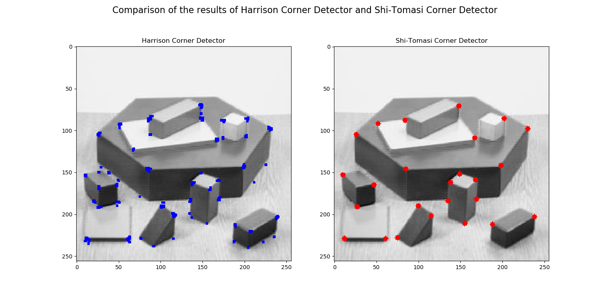

# Shi-Tomasi Corner Detector & Good Features to Track

_You can view [Ipython Notebook](README.ipynb) report._

----

## Contents

- [GOAL](#GOAL)
- [Theory](#Theory)
- [Code](#Code)

## GOAL

In this chapter:

- We will learn about the another corner detector: Shi-Tomasi Corner Detector.
- We will see the function: [cv.goodFeaturesToTrack()](https://docs.opencv.org/3.4.1/dd/d1a/group__imgproc__feature.html#ga1d6bb77486c8f92d79c8793ad995d541).

## Theory

In last chapter, we saw Harris Corner Detector. Later in 1994, J. Shi and C. Tomasi made a small modification to it in their paper **Good Features to Track** which shows better results compared to Harris Corner Detector. The scoring function in Harris Corner Detector was given by:

$$ R = \lambda_1 \lambda_2 - k(\lambda_1+\lambda_2)^2 $$

Instead of this, Shi-Tomasi proposed:

$$ R = min(\lambda_1, \lambda_2) $$

If it is a greater than a threshold value, it is considered as a corner. If we plot it in $ λ1−λ2 $ space as we did in Harris Corner Detector, we get an image as below:


From the figure, you can see that only when $ λ1 $ and $ λ2 $ are above a minimum value, $ λmin $, it is conidered as a corner(green region).

## Code

OpenCV has a function, [cv.goodFeaturesToTrack()](https://docs.opencv.org/3.4.1/dd/d1a/group__imgproc__feature.html#ga1d6bb77486c8f92d79c8793ad995d541). It finds N strongest corners in the image by Shi-Tomasi method (or Harris Corner Detection, if you specify it). As usual, image should be a grayscale image. Then you specify number of corners you want to find. Then you specify the quality level, which is a value between 0-1, which denotes the minimum quality of corner below which everyone is rejected. Then we provide the minimum euclidean distance between corners detected.

With all this information, the function finds corners in the image. All corners below quality level are rejected. Then it sorts the remaining corners based on quality in the descending order. Then function takes first strongest corner, throws away all the nearby corners in the range of minimum distance and returns N strongest corners.

In below example, we will try to find 25 best corners: 

```python
import numpy as np
import cv2 as cv
from matplotlib import pyplot as plt

img = cv.imread('input-files/blox.jpg')
gray = cv.cvtColor(img,cv.COLOR_BGR2GRAY)

corners = cv.goodFeaturesToTrack(gray,25,0.01,10)
corners = np.int0(corners)

for i in corners:
    x,y = i.ravel()
    cv.circle(img,(x,y),3,255,-1)
    
plt.imshow(img),plt.show()
```

See the results of Harris Corner Detector and Shi-Tomasi Corner Detector below:



This function is more appropriate for tracking. We will see that when its time comes.
