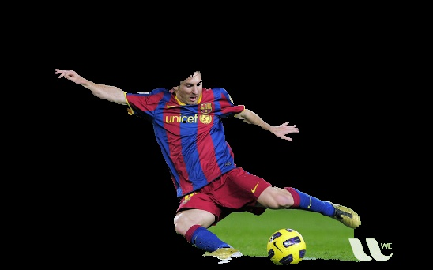
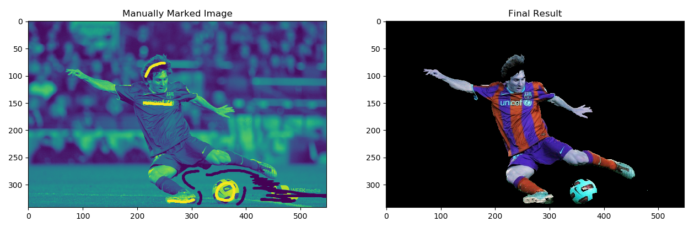

# Interactive Foreground Extraction using GrabCut Algorithm 

## Goal

In this chapter:

- We will see GrabCut algorithm to extract foreground in images.
- We will create an interactive application for this.

## Theory

GrabCut algorithm was designed by Carsten Rother, Vladimir Kolmogorov & Andrew Blake from Microsoft Research Cambridge, UK. In their paper, ["GrabCut": interactive foreground extraction using iterated graph cuts](https://dl.acm.org/citation.cfm?id=1015720). An algorithm was needed for foreground extraction with minimal user interaction, and the result was GrabCut.

How it works from user point of view? Initially user draws a rectangle around the foreground region (foreground region should be completely inside the rectangle). Then algorithm segments it iteratively to get the best result. Done. But in some cases, the segmentation won't be fine, like, it may have marked some foreground region as background and vice versa. In that case, user need to do fine touch-ups. Just give some strokes on the images where some faulty results are there. Strokes basically says _"Hey, this region should be foreground, you marked it background, correct it in next iteration"_ or its opposite for background. Then in the next iteration, you get better results.

See the image below. First player and football is enclosed in a blue rectangle. Then some final touch-ups with white strokes (denoting foreground) and black strokes (denoting background) is made. And we get a nice result.

So what happens in background ?

- User inputs the rectangle. Everything outside this rectangle will be taken as sure background (That is the reason it is mentioned before that your rectangle should include all the objects). Everything inside rectangle is unknown. Similarly any user input specifying foreground and background are considered as hard-labelling which means they won't change in the process.

- Computer does an initial labelling depeding on the data we gave. It labels the foreground and background pixels (or it hard-labels).

- Now a [Gaussian Mixture Model (GMM)](https://jakevdp.github.io/PythonDataScienceHandbook/05.12-gaussian-mixtures.html) is used to model the foreground and background.

- Depending on the data we gave, GMM learns and create new pixel distribution. That is, the unknown pixels are labelled either probable foreground or probable background depending on its relation with the other hard-labelled pixels in terms of color statistics (It is just like clustering).

- A graph is built from this pixel distribution. Nodes in the graphs are pixels. Additional two nodes are added, Source node and Sink node. Every foreground pixel is connected to Source node and every background pixel is connected to Sink node.

- The weights of edges connecting pixels to source node/end node are defined by the probability of a pixel being foreground/background. The weights between the pixels are defined by the edge information or pixel similarity. If there is a large difference in pixel color, the edge between them will get a low weight.

- Then a mincut algorithm is used to segment the graph. It cuts the graph into two separating source node and sink node with minimum cost function. The cost function is the sum of all weights of the edges that are cut. After the cut, all the pixels connected to Source node become foreground and those connected to Sink node become background.

- The process is continued until the classification converges.

It is [illustrated](http://www.cs.ru.ac.za/research/g02m1682/) in below image.

## Demo

Now we go for grabcut algorithm with OpenCV. OpenCV has the function, [cv.grabCut()](https://docs.opencv.org/3.4.1/d7/d1b/group__imgproc__misc.html#ga909c1dda50efcbeaa3ce126be862b37f) for this. We will see its arguments first:

- _img_ - Input image.

- _mask_ - It is a mask image where we specify which areas are background, foreground or probable background/foreground etc. It is done by the following flags, [cv.GC_BGD][link-1], [cv.GC_FGD][link-1], [cv.GC_PR_BGD][link-1], [cv.GC_PR_FGD][link-1], or simply pass 0,1,2,3 to image.

[link-1]:https://docs.opencv.org/3.4.1/d7/d1b/group__imgproc__misc.html#ggad43d3e4208d3cf025d8304156b02ba38a889f1ce109543e8aed80a7abbc6dcb39

- _rect_ - It is the coordinates of a rectangle which includes the foreground object in the format (_x, y, w, h_)

- _bdgModel, fgdModel_ - These are arrays used by the algorithm internally. You just create two np.float64 type zero arrays of size (1, 65).

- _iterCount_ - Number of iterations the algorithm should run.

- _mode_ - It should be [cv.GC_INIT_WITH_RECT][link-2] or [cv.GC_INIT_WITH_MASK][link-2] or combined which decides whether we are drawing rectangle or final touch-up strokes.

[link-2]: https://docs.opencv.org/3.4.1/d7/d1b/group__imgproc__misc.html#ggaf8b5832ba85e59fc7a98a2afd034e558a5f8853c1e5a89c4aa2687d1f78a7e550

First let's see with rectangular mode. We load the image, create a similar mask image. We create fgdModel and bgdModel. We give the rectangle parameters. It's all straight-forward. Let the algorithm run for 5 iterations. Mode should be [cv.GC_INIT_WITH_RECT][link-2] since we are using rectangle. Then run the grabcut. It modifies the mask image. In the new mask image, pixels will be marked with four flags denoting background/foreground as specified above. So we modify the mask such that all 0-pixels and 2-pixels are put to 0 (ie background) and all 1-pixels and 3-pixels are put to 1 (ie foreground pixels). Now our final mask is ready. Just multiply it with input image to get the segmented image. 

[Check the code here](interactive-foreground-extraction-1.py)

See the results below:

Oops, Messi's hair is gone. Who likes Messi without his hair? We need to bring it back. So we will give there a fine touch-up with 1-pixel (sure foreground). At the same time, Some part of ground has come to picture which we don't want, and also some logo. We need to remove them. There we give some 0-pixel touch-up (sure background). So we modify our resulting mask in previous case as we told now.

What I actually did is that, I opened input image in paint application and added another layer to the image. Using brush tool in the paint, I marked missed foreground (hair, shoes, ball etc) with white and unwanted background (like logo, ground etc) with black on this new layer. Then filled remaining background with gray. Then loaded that mask image in OpenCV, edited original mask image we got with corresponding values in newly added mask image. 

[Check the code here](interactive-foreground-extraction-2.py) 

See the result below:

$$ x = 1 $$

