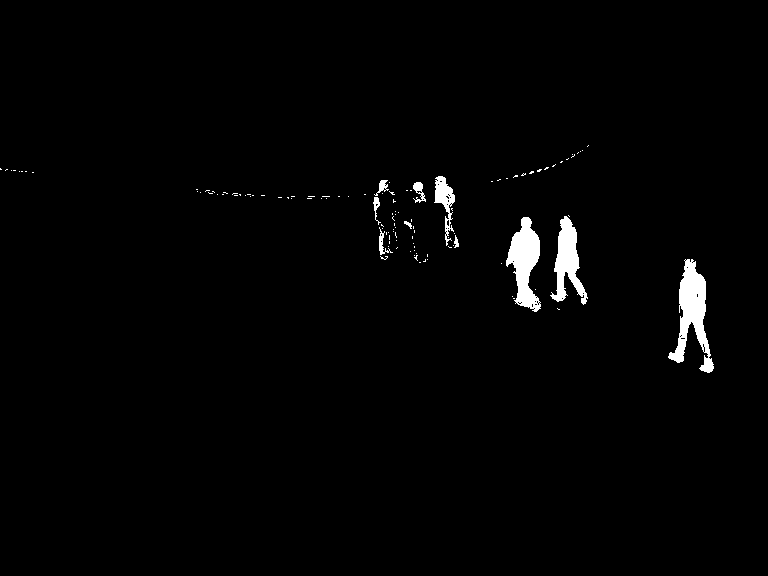

# Background Subtraction

_You can view [IPython Nootebook](README.ipynb) report._

----

## Contents

- [GOAL](#GOAL)
- [Basics](#Basics)
  - [BackgroundSubtractorMOG](#BackgroundSubtractorMOG)
  - [BackgroundSubtractorMOG2](#BackgroundSubtractorMOG2)
  - [BackgroundSubtractorGMG](#BackgroundSubtractorGMG)
- [Results](#Results)

## GOAL

In this chapter:

- We will familiarize with the background subtraction methods available in OpenCV.

## Basics

Background subtraction is a major preprocessing step in many vision-based applications. For example, consider the case of a visitor counter where a static camera takes the number of visitors entering or leaving the room, or a traffic camera extracting information about the vehicles etc. In all these cases, first you need to extract the person or vehicles alone. Technically, you need to extract the moving foreground from static background.

If you have an image of background alone, like an image of the room without visitors, image of the road without vehicles etc, it is an easy job. Just subtract the new image from the background. You get the foreground objects alone. But in most of the cases, you may not have such an image, so we need to extract the background from whatever images we have. It become more complicated when there are shadows of the vehicles. Since shadows also move, simple subtraction will mark that also as foreground. It complicates things.

Several algorithms were introduced for this purpose. OpenCV has implemented three such algorithms which are very easy to use. We will see them one-by-one.

### BackgroundSubtractorMOG

It is a Gaussian Mixture-based Background/Foreground Segmentation Algorithm. It was introduced in the paper ["An improved adaptive background mixture model for real-time tracking with shadow detection"](http://personal.ee.surrey.ac.uk/Personal/R.Bowden/publications/avbs01/avbs01.pdf) by **P. KadewTraKuPong** and **R. Bowden** in 2001. It uses a method to model each background pixel by a mixture of $ K $ Gaussian distributions ($ K $ = 3 to 5). The weights of the mixture represent the time proportions that those colours stay in the scene. The probable background colours are the ones which stay longer and more static.

While coding, we need to create a background object using the function, [cv.createBackgroundSubtractorMOG()](https://docs.opencv.org/3.4.1/d6/d17/group__cudabgsegm.html#ga6742648a654585013544eaa300f77b57). It has some optional parameters like length of history, number of gaussian mixtures, threshold etc. It is all set to some default values. Then inside the video loop, use _backgroundsubtractor.apply()_ method to get the foreground mask.

See a simple example below:

```python
import numpy as np
import cv2 as cv

cap = cv.VideoCapture("../../data/vtest.avi")

# Create BackgroundSubtractor object
fgbg = cv.bgsegm.createBackgroundSubtractorMOG()

# Define the codec and create VideoWriter object
fourcc = cv.VideoWriter_fourcc(*'XVID')
width = int(cap.get(cv.CAP_PROP_FRAME_WIDTH))
height = int(cap.get(cv.CAP_PROP_FRAME_HEIGHT))
outVideo = cv.VideoWriter("output-files/MOG-res.avi",
                          fourcc, 25.0, (width, height), False)

# Saved frame number
frame_number = 0

while True:
    ret, frame = cap.read()
    fgmask = fgbg.apply(frame)  # Get the foreground mask

    # Save the image and show it
    outVideo.write(fgmask)
    cv.imshow("frame", frame)
    cv.imshow("foreground", fgmask)
    k = cv.waitKey(60) & 0xff
    if k == 27:  # Press "esc" to exit
        break
    elif k == ord('s'):  # Press "s" to save current frame and result for it
        cv.imwrite("output-files/" + "MOG-src-" +
                   str(frame_number) + ".png", frame)
        cv.imwrite("output-files/" + "MOG-res-" +
                   str(frame_number) + ".png", fgmask)
        frame_number += 1
cap.release()
outVideo.release()
cv.destroyAllWindows()
```

(All the results are shown at the end for comparison.)

### BackgroundSubtractorMOG2

It is also a Gaussian Mixture-based Background/Foreground Segmentation Algorithm. It is based on two papers by **Z.Zivkovic**, ["Improved adaptive Gaussian mixture model for background subtraction"](http://www.zoranz.net/Publications/zivkovic2004ICPR.pdf) in 2004 and ["Efficient Adaptive Density Estimation per Image Pixel for the Task of Background Subtraction"](https://www.researchgate.net/publication/222571251_Efficient_adaptive_density_estimation_per_image_pixel_for_the_task_of_background_subtraction) in 2006. One important feature of this algorithm is that it selects the appropriate number of gaussian distribution for each pixel. (Remember, in last case, we took a $ K $ gaussian distributions throughout the algorithm). It provides better adaptibility to varying scenes due illumination changes etc.

As in previous case, we have to create a background subtractor object. Here, you have an option of detecting shadows or not. If _detectShadows_ = True (which is so by default), it detects and marks shadows, but decreases the speed. Shadows will be marked in gray color.

```python
import numpy as np
import cv2 as cv

cap = cv.VideoCapture("../../data/vtest.avi")

# Create BackgroundSubtractor object
fgbg = cv.createBackgroundSubtractorMOG2()

# Define the codec and create VideoWriter object
fourcc = cv.VideoWriter_fourcc(*'XVID')
width = int(cap.get(cv.CAP_PROP_FRAME_WIDTH))
height = int(cap.get(cv.CAP_PROP_FRAME_HEIGHT))
outVideo = cv.VideoWriter("output-files/MOG2-res.avi",
                          fourcc, 25.0, (width, height), False)

# Saved frame number
frame_number = 0

while True:
    ret, frame = cap.read()
    fgmask = fgbg.apply(frame)  # Get the foreground mask

    # Save the image and show it
    outVideo.write(fgmask)
    cv.imshow("frame", frame)
    cv.imshow("foreground", fgmask)
    k = cv.waitKey(60) & 0xff
    if k == 27:  # Press "esc" to exit
        break
    elif k == ord('s'):  # Press "s" to save current frame and result for it
        cv.imwrite("output-files/" + "MOG2-src-" +
                   str(frame_number) + ".png", frame)
        cv.imwrite("output-files/" + "MOG2-res-" +
                   str(frame_number) + ".png", fgmask)
        frame_number += 1
cap.release()
outVideo.release()
cv.destroyAllWindows()
```

(The results are given at the end.)

### BackgroundSubtractorGMG

This algorithm combines statistical background image estimation and per-pixel Bayesian segmentation. It was introduced by **Andrew B. Godbehere**, **Akihiro Matsukawa**, and **Ken Goldberg** in their paper ["Visual Tracking of Human Visitors under Variable-Lighting Conditions for a Responsive Audio Art Installation"](http://goldberg.berkeley.edu/pubs/acc-2012-visual-tracking-final.pdf) in 2012. As per the paper, the system ran a successful interactive audio art installation called “Are We There Yet?” from March 31 - July 31 2011 at the Contemporary Jewish Museum in San Francisco, California.

It uses first few (120 by default) frames for background modelling. It employs probabilistic foreground segmentation algorithm that identifies possible foreground objects using Bayesian inference. The estimates are adaptive; newer observations are more heavily weighted than old observations to accommodate variable illumination. Several morphological filtering operations like closing and opening are done to remove unwanted noise. You will get a black window during first few frames.

It would be better to apply morphological opening to the result to remove the noises.

```python
import numpy as np
import cv2 as cv

cap = cv.VideoCapture("../../data/vtest.avi")

kernel = cv.getStructuringElement(cv.MORPH_ELLIPSE, (3, 3))
fgbg = cv.bgsegm.createBackgroundSubtractorGMG(initializationFrames=5)

# Define the codec and create VideoWriter object
fourcc = cv.VideoWriter_fourcc(*'XVID')
width = int(cap.get(cv.CAP_PROP_FRAME_WIDTH))
height = int(cap.get(cv.CAP_PROP_FRAME_HEIGHT))
outVideo = cv.VideoWriter("output-files/GMG-res.avi",
                          fourcc, 25.0, (width, height), False)

# Saved frame number
frame_number = 0

while True:
    ret, frame = cap.read()
    fgmask = fgbg.apply(frame)
    fgmask = cv.morphologyEx(fgmask, cv.MORPH_OPEN, kernel)

    # Save the image and show it
    outVideo.write(fgmask)
    cv.imshow("frame", frame)
    cv.imshow("foreground", fgmask)
    k = cv.waitKey(60) & 0xff
    if k == 27:  # Press "esc" to exit
        break
    elif k == ord('s'):  # Press "s" to save current frame and result for it
        cv.imwrite("output-files/" + "GMG-src-" +
                   str(frame_number) + ".png", frame)
        cv.imwrite("output-files/" + "GMG-res-" +
                   str(frame_number) + ".png", fgmask)
        frame_number += 1
cap.release()
outVideo.release()
cv.destroyAllWindows()
```

## Results

### Original Frame

Below image shows the 50th frame of a video.


### Result of BackgroundSubtractorMOG



### Result of BackgroundSubtractorMOG2

Gray color region shows shadow region.


### Result of BackgroundSubtractorGMG

Noise is removed with morphological opening.


