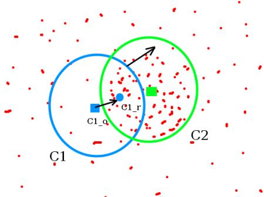
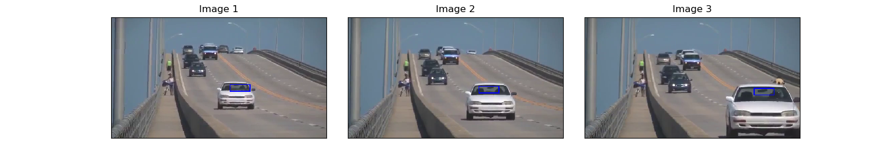
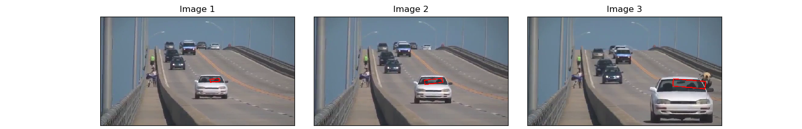

# Meanshift and Camshift 

_You can view [IPython Nootebook](README.ipynb) report._

----

## Contents

- [GOAL](#GOAL)
- [Meanshift](#Meanshift)
  - [Meanshift in OpenCV](#Meanshift-in-OpenCV)
- [Camshift](#Camshift)
  - [Camshift in OpenCV](#Camshift-in-OpenCV)
- [Additional Resources](#Additional-Resources )
- [Exercises](#Exercises)


## GOAL

In this chapter:

- We will learn about Meanshift and Camshift algorithms to find and track objects in videos.

## Meanshift

The intuition behind the meanshift is simple. Consider you have a set of points. (It can be a pixel distribution like histogram backprojection). You are given a small window ( may be a circle) and you have to move that window to the area of maximum pixel density (or maximum number of points). It is illustrated in the simple image given below:



The initial window is shown in blue circle with the name "C1". Its original center is marked in blue rectangle, named "C1_o". But if you find the centroid of the points inside that window, you will get the point "C1_r" (marked in small blue circle) which is the real centroid of window. Surely they don't match. So move your window such that circle of the new window matches with previous centroid. Again find the new centroid. Most probably, it won't match. So move it again, and continue the iterations such that center of window and its centroid falls on the same location (or with a small desired error). So finally what you obtain is a window with maximum pixel distribution. It is marked with green circle, named "C2". As you can see in image, it has maximum number of points. The whole process is demonstrated on a static image below:


So we normally pass the histogram backprojected image and initial target location. When the object moves, obviously the movement is reflected in histogram backprojected image. As a result, meanshift algorithm moves our window to the new location with maximum density.

### Meanshift in OpenCV

To use meanshift in OpenCV, first we need to setup the target, find its histogram so that we can backproject the target on each frame for calculation of meanshift. We also need to provide initial location of window. For histogram, only Hue is considered here. Also, to avoid false values due to low light, low light values are discarded using [cv.inRange()](https://docs.opencv.org/3.4.1/d2/de8/group__core__array.html#ga48af0ab51e36436c5d04340e036ce981) function.

```python
import numpy as np
import cv2 as cv

cap = cv.VideoCapture("../../data/slow.mp4")
# take first frame of the video
ret, frame = cap.read()

# setup initial location of window
r, h, c, w = 190, 20, 330, 60  # simply hardcoded the values
track_window = (c, r, w, h)

# set up the ROI for tracking
roi = frame[r:r+h, c:c+w]
hsv_roi = cv.cvtColor(roi, cv.COLOR_BGR2HSV)
mask = cv.inRange(hsv_roi, np.array((0., 60., 32.)), \
                  np.array((180., 255., 255.)))
roi_hist = cv.calcHist([hsv_roi], [0], mask, [180], [0, 180])
cv.normalize(roi_hist, roi_hist, 0, 255, cv.NORM_MINMAX)

# setup the termination criteria, either 10 iteration or move by at least 1 pt
term_crit = (cv.TERM_CRITERIA_EPS | cv.TERM_CRITERIA_COUNT, 10, 1)

# Define the codec and create VideoWriter object
fourcc = cv.VideoWriter_fourcc(*'XVID')
outVideo = cv.VideoWriter("output-files/meanshift-res.avi", \
                          fourcc, 25.0, (640, 360))

# saved frame number
frame_number = 0

while True:
    ret, frame = cap.read()
    if ret is True:
        hsv = cv.cvtColor(frame, cv.COLOR_BGR2HSV)
        dst = cv.calcBackProject([hsv], [0], roi_hist, [0, 180], 1)

        # apply meanshift to get the new location
        ret, track_window = cv.meanShift(dst, track_window, term_crit)

        # draw it on image
        x, y, w, h = track_window
        img2 = cv.rectangle(frame, (x, y), (x+w, y+h), 255, 2)

        # save the image and show it
        outVideo.write(img2)
        cv.imshow("img2", img2)
        k = cv.waitKey(60) & 0xFF
        if k == 27:  # press "esc" to exit
            break
        elif k == 0x73:  # press "s" to save the current frame
            cv.imwrite("output-files/" + "meanshift-res-" + \
                       str(frame_number) + ".png", img2)
            frame_number += 1
    else:
        break
cv.destroyAllWindows()
cap.release()
```

Three frames in a video I used is given below:



## Camshift

Did you closely watch the last result? There is a problem. Our window always has the same size when car is farther away and it is very close to camera. That is not good. We need to adapt the window size with size and rotation of the target. Once again, the solution came from "OpenCV Labs" and it is called CAMshift (Continuously Adaptive Meanshift) published by Gary Bradsky in his paper "Computer Vision Face Tracking for Use in a Perceptual User Interface" in 1988.

It applies meanshift first. Once meanshift converges, it updates the size of the window as, $ s = 2 \times \sqrt{\frac{M_{00}}{256}} $. It also calculates the orientation of best fitting ellipse to it. Again it applies the meanshift with new scaled search window and previous window location. The process is continued until required accuracy is met.


### Camshift in OpenCV

It is almost same as meanshift, but it returns a rotated rectangle (that is our result) and box parameters (used to be passed as search window in next iteration). See the code below:

```python
import numpy as np
import cv2 as cv

cap = cv.VideoCapture("../../data/slow.mp4")
# take first frame of the video
ret, frame = cap.read()

# setup initial location of window
r, h, c, w = 190, 20, 330, 60  # simply hardcoded the values
track_window = (c, r, w, h)

# set up the ROI for tracking
roi = frame[r:r+h, c:c+w]
hsv_roi = cv.cvtColor(roi, cv.COLOR_BGR2HSV)
mask = cv.inRange(hsv_roi, np.array((0., 60., 32.)), \
                  np.array((180., 255., 255.)))
roi_hist = cv.calcHist([hsv_roi], [0], mask, [180], [0, 180])
cv.normalize(roi_hist, roi_hist, 0, 255, cv.NORM_MINMAX)

# setup the termination criteria, either 10 iteration or move by at least 1 pt
term_crit = (cv.TERM_CRITERIA_EPS | cv.TERM_CRITERIA_COUNT, 10, 1)

# Define the codec and create VideoWriter object
fourcc = cv.VideoWriter_fourcc(*'XVID')
outVideo = cv.VideoWriter("output-files/camshift-res.avi", \
                          fourcc, 25.0, (640, 360))

# saved frame number
frame_number = 0

while True:
    ret, frame = cap.read()
    if ret is True:
        hsv = cv.cvtColor(frame, cv.COLOR_BGR2HSV)
        dst = cv.calcBackProject([hsv], [0], roi_hist, [0, 180], 1)

        # apply camshift to get the new location
        ret, track_window = cv.CamShift(dst, track_window, term_crit)

        # Draw it on image
        pts = cv.boxPoints(ret)
        pts = np.int0(pts)
        img2 = cv.polylines(frame, [pts], True, (0, 0, 255), 2)

        # save the image and show it
        outVideo.write(img2)
        cv.imshow('img2',img2)
        k = cv.waitKey(60) & 0xFF
        if k == 27:  # press "esc" to exit
            break
        elif k == 0x73:  # press "s" to save the current frame
            cv.imwrite("output-files/" + "camshift-res-" + \
                       str(frame_number) + ".png", img2)
            frame_number += 1
    else:
        break
cv.destroyAllWindows()
cap.release()
```

Three frames of the result is shown below:



## Additional Resources 

1. French Wikipedia page on Camshift. (The two animations are taken from here)
2. Bradski, G.R., "Real time face and object tracking as a component of a perceptual user interface," Applications of Computer Vision, 1998. WACV '98. Proceedings., Fourth IEEE Workshop on , vol., no., pp.214,219, 19-21 Oct 1998

## Exercises

1. OpenCV comes with a Python sample on interactive demo of camshift. Use it, hack it, understand it. 
